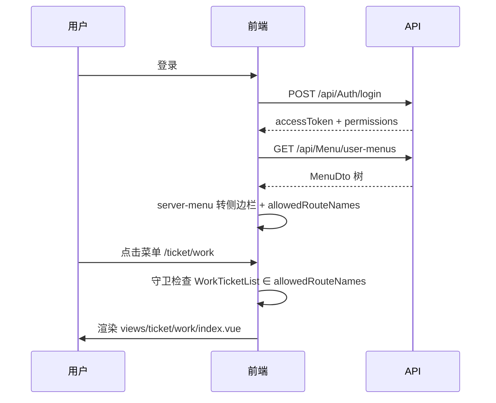

# 服务端菜单机制

当 `menuFromServer: true` 时，侧边栏与页面访问权由后端菜单驱动，前端静态路由提供组件映射。

## 数据流



---

## 后端菜单字段

| 字段 | 说明 | 示例 |
|------|------|------|
| `path` | 浏览器路径 | `/ticket/work` |
| `component` | 视图相对路径 | `ticket/work/index` |
| `perms` | 页面权限码 | `ticket:work:list` |
| `menuType` | 0目录 1菜单 2按钮 | `Menu` |
| `icon` | 图标（无 `icon-` 前缀） | `file` |
| `isVisible` | 是否在侧边栏显示 | `true` |

种子示例：

```csharp
new Menu
{
    Name = "工单列表",
    MenuType = MenuType.Menu,
    Perms = RbacPermissionCodes.Ticket.Work.List,
    Path = "/ticket/work",
    Component = "ticket/work/index",
    Icon = "file",
}
```

---

## PATH_TO_ROUTE_NAME

`src/utils/server-menu.ts` 核心映射：

```typescript
const PATH_TO_ROUTE_NAME: Record<string, string> = {
  '/ticket': 'ticket',
  '/ticket/work': 'WorkTicketList',
  '/ticket/process': 'WorkTicketProcess',
};
```

转换逻辑：

1. 遍历用户菜单树
2. 对每个 `MenuType.Menu`，取 `path` 查表得 `routeName`
3. 将 `routeName` 加入 `allowedRouteNames`
4. 目录节点用父级 `name` 组装侧边栏

**新增页面必做**：在后端加菜单 + 在前端加路由 + 在映射表加一行。

---

## 与静态路由的配合

静态路由负责：

- 注册 `component` 懒加载
- 定义 `meta.locale`、`meta.icon`
- Layout 嵌套（`DEFAULT_LAYOUT`）

服务端菜单负责：

- 用户能看到哪些项
- 用户能访问哪些 `routeName`

两者通过 **path → name** 桥接。

---

## 路由守卫逻辑

`src/router/guard/permission.ts` 片段：

```typescript
if (appStore.menuFromServer) {
  await appStore.fetchServerMenuConfig(router);

  const hasMenuAccess =
    isWhiteListed || appStore.allowedRouteNames.includes(routeName);

  if (!hasMenuAccess) {
    next({ name: FORBIDDEN });
    return;
  }
}
```

白名单路由（登录页等）在 `ROUTE_ACCESS_WHITE_LIST` 中。

---

## 静态菜单合并

`meta.staticMenu: true` 的路由会通过 `getStaticMenuRoutes()` 并入侧边栏：

```typescript
// src/router/static-menus.ts
export function getStaticMenuRoutes(): RouteRecordRaw[] {
  return appClientMenus.filter((route) => route.meta?.staticMenu === true);
}
```

用于组件演示等**不需要后端种子**的页面。

---

## 外链菜单

外部链接菜单会注册动态路由，刷新时 `permission.ts` 中有专门处理逻辑（`isExternalLocationPath`）。

---

## 排错指南

| 现象 | 检查 |
|------|------|
| 菜单不显示 | 角色是否分配、`isEnabled`、`isVisible` |
| 403 | `PATH_TO_ROUTE_NAME`、路由 `name` 拼写 |
| 404 | 静态路由是否注册、`component` 路径是否存在 |
| 菜单乱序 | 后端 `Sort` 字段 |

下一步：[权限控制](./permission)
