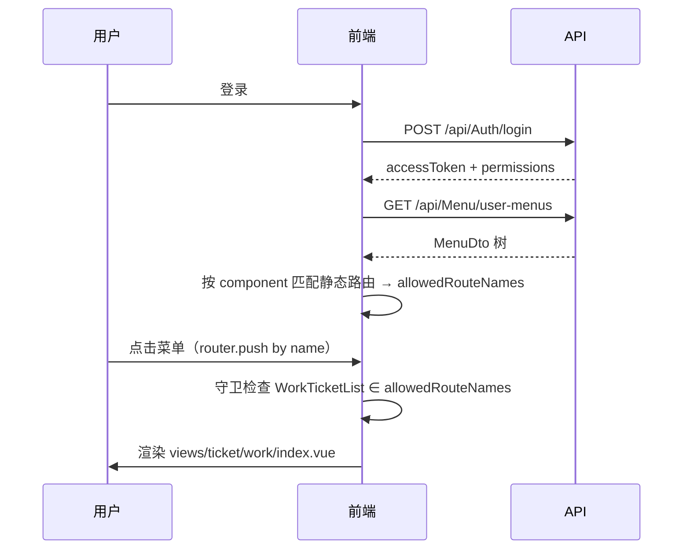

# 服务端菜单机制

当 `menuFromServer: true` 时，侧边栏与页面访问权由后端菜单驱动，前端静态路由提供组件映射。

## 数据流



---

## 后端菜单字段

| 字段 | 说明 | 示例 |
|------|------|------|
| `path` | 路由地址，**可自定义** | `/ticket/work` 或 `/my-tickets` |
| `component` | 视图相对路径，**用于匹配** | `ticket/work/index` |
| `perms` | 页面权限码 | `ticket:work:list` |
| `menuType` | 0目录 1菜单 2按钮 | `Menu` |
| `icon` | 图标（无 `icon-` 前缀） | `file` |
| `isVisible` | 是否在侧边栏显示 | `true` |

种子示例：

```csharp
new Menu
{
    Name = "工单列表",
    MenuType = MenuType.Menu,
    Perms = RbacPermissionCodes.Ticket.Work.List,
    Path = "/ticket/work",              // 可改成任意地址
    Component = "ticket/work/index",    // 必须与 views 路径一致
    Icon = "file",
}
```

---

## component → route name（自动推导）

`src/utils/server-menu.ts` 从静态路由懒加载函数解析 `views/` 路径，构建 component 索引：

```typescript
const staticComponentMap = buildStaticComponentMap(staticClientRoutes);

function extractViewComponentKey(component: RouteRecordRaw['component']) {
  const match = component.toString().match(/views[/\\](.+?)\.vue/i);
  return match?.[1]; // ticket/work/index
}

function resolveRouteNameFromComponent(component?: string | null) {
  const route = staticComponentMap.get(normalizeComponentKey(component)!);
  return route?.name ? String(route.name) : undefined;
}
```

`collectAllowedRouteNames` 流程：

1. 遍历用户菜单树，对 `MenuType.Menu` 取 `component`
2. 在 `staticComponentMap` 中查找，得到 `route name`
3. 加入 `allowedRouteNames`
4. `includeAncestorRouteNames`：自动补全父级 Layout

登录后 `collectInternalRoutesFromMenus` 会按后端菜单树 **重新注册路由**（`path` 取自后端），覆盖静态路由中的默认地址。

**新增页面只需**：

- 前端：`router/routes/modules/*.ts` + `views/`（提供 component 模板）
- 后端：菜单管理配置 `component` + `path`

`component` 必须与 `views/` 一致；`path` 为实际访问地址，可自定义。

---

## 与静态路由的配合

| 职责 | 静态路由 | 服务端菜单 |
|------|----------|------------|
| 组件懒加载 | ✅ | |
| `meta.locale` / 图标 | ✅ | |
| Layout 嵌套 | ✅ | |
| 谁能看到菜单 | | ✅ |
| 谁能访问页面 | | ✅（经 component 映射 name） |
| 路由 URL | | ✅（`path` 动态注册到 vue-router） |

两者通过 **component 匹配页面、path 注册地址** 协作。

---

## 路由守卫逻辑

`src/router/guard/permission.ts` 片段：

```typescript
if (appStore.menuFromServer) {
  await appStore.fetchServerMenuConfig(router);

  const hasMenuAccess =
    isWhiteListed || appStore.allowedRouteNames.includes(routeName);

  if (!hasMenuAccess) {
    next({ name: FORBIDDEN });
    return;
  }
}
```

白名单路由（登录页等）在 `ROUTE_ACCESS_WHITE_LIST` 中。

---

## 静态菜单合并

`meta.staticMenu: true` 的路由会通过 `getStaticMenuRoutes()` 并入侧边栏：

```typescript
// src/router/static-menus.ts
export function getStaticMenuRoutes(): RouteRecordRaw[] {
  return appClientMenus.filter((route) => route.meta?.staticMenu === true);
}
```

用于组件演示等**不需要后端种子**的页面。

---

## 外链菜单

外部链接菜单会注册动态路由，刷新时 `permission.ts` 中有专门处理逻辑（`isExternalLocationPath`）。

---

## 排错指南

| 现象 | 检查 |
|------|------|
| 菜单不显示 | 角色是否分配、`isEnabled`、`isVisible` |
| 403 | 后端 `component` 是否与 `views/` 一致（如 `ticket/work/index`） |
| 404 | 静态路由是否注册、`views` 文件是否存在 |
| 菜单乱序 | 后端 `Sort` 字段 |

下一步：[权限控制](./permission)
